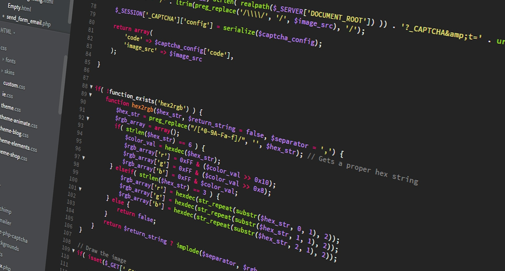

### True versus Truthy

To understand this topic you need first of all to know the difference between falseys and truthys values.

### The following values are considered by JavaScript to be falseys:

1. Empty string: ""
2. 0
3. null
4. undefined
5. NaN

### The following values are considered by JavaScript to be truthys:

1. Object: { }
2. Array: [ ]
3. Not empty string: "anything"
4. Number other than zero: 3.14
5. Date: new Date();

Thruthy value means - when converted to boolean, they are true.
Falseys value means - when converted to boolean, they are false.

### Double exclamation marks?

Basically it allows you to cast your values to boolean

```javascript
const s = 'JavaScript syntax highlighting';

alert(typeof s);

const booleanValue = !!s;

alert(typeof booleanValue);
```
